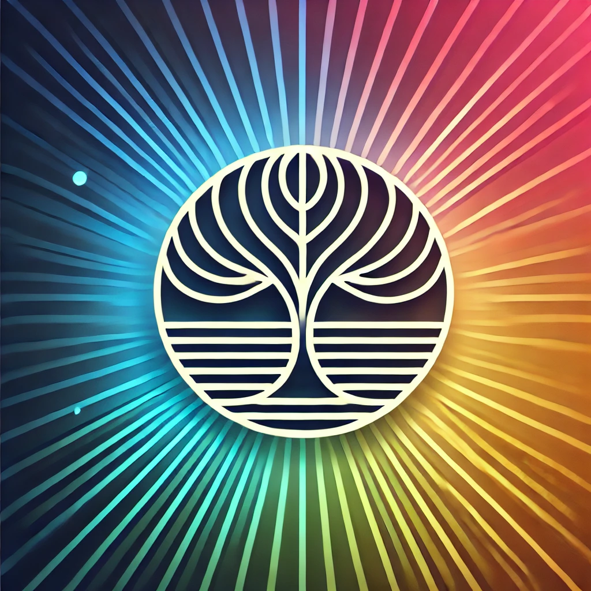

# RAGLight


[](https://pepy.tech/projects/raglight)

<div align="center">
    
</div>

**RAGLight** is a lightweight and modular Python library for implementing **Retrieval-Augmented Generation (RAG)**. It enhances the capabilities of Large Language Models (LLMs) by combining document retrieval with natural language inference.

Designed for simplicity and flexibility, RAGLight provides modular components to easily integrate various LLMs, embeddings, and vector stores, making it an ideal tool for building context-aware AI solutions.

---

> ## ⚠️ Requirements
>
> Actually RAGLight supports :
>
> - Ollama
> - LMStudio
> - Mistral API
>
> You need to have Ollama or LMStudio running on your computer. Or you
> need to have a Mistral API key.
>
> If you use LMStudio, ou need to have the model you want to use loaded in LMStudio.

## Features

- **Embeddings Model Integration**: Plug in your preferred embedding models (e.g., HuggingFace **all-MiniLM-L6-v2**) for compact and efficient vector embeddings.
- **LLM Agnostic**: Seamlessly integrates with different LLMs from different providers (Ollama and LMStudio supported).
- **RAG Pipeline**: Combines document retrieval and language generation in a unified workflow.
- **RAT Pipeline**: Combines document retrieval and language generation in a unified workflow. Add reflection loops using a reasoning model like **Deepseek-R1** or **o1**.
- **Agentic RAG Pipeline**: Use Agent to improve your RAG performances.
- **Flexible Document Support**: Ingest and index various document types (e.g., PDF, TXT, DOCX, Python, Javascript, ...).
- **Extensible Architecture**: Easily swap vector stores, embedding models, or LLMs to suit your needs.

---

## Import library 🛠️

If you want to install library, use :

```bash
pip install raglight
```

---

## Environment Variables

You can set several environment vaiables to change **RAGLight** settings :

- `MISTRAL_API_KEY` if you want to use Mistral API
- `OLLAMA_CLIENT_URL` if you have a custom Ollama URL
- `LMSTUDIO_CLIENT` if you have a custom LMStudio URL

## Providers and databases

### LLM

For your LLM inference, you can use these providers :

- LMStudio (`Settings.LMSTUDIO`)
- Ollama (`Settings.OLLAMA`)
- Mistral API (`Settings.MISTRAL`)

### Embeddings

For embeddings models, you can use these providers :

- Huggingface (`Settings.HUGGINGFACE`)
- Ollama (`Settings.OLLAMA`)

### Vector Store

For your vector store, you can use :

- Chroma (`Settings.CHROMA`)

## Quick Start 🚀

<details>
<summary> <b>Knowledge Base</b> </summary>

Knowledge Base is a way to define data you want to ingest inside your vector store during the initialization of your RAG.
It's the data ingest when you call `build` function :

```python
from raglight import RAGPipeline
pipeline = RAGPipeline(knowledge_base=[
    FolderSource(path="<path to your folder with pdf>/knowledge_base"),
    GitHubSource(url="https://github.com/Bessouat40/RAGLight")
    ],
    model_name="llama3",
    provider=Settings.OLLAMA,
    k=5)

pipeline.build()
```

You can define two different knowledge base :

1. Folder Knowledge Base

All files/folders into this directory will be ingested inside the vectore store :

```python
from raglight import FolderSource
FolderSource(path="<path to your folder with pdf>/knowledge_base"),
```

2. Github Knowledge Base

You can declare Github Repositories you want to store into your vector store :

```python
from raglight import GitHubSource
GitHubSource(url="https://github.com/Bessouat40/RAGLight")
```

</details>

<details>
<summary> <b>RAG</b> </summary>

You can setup easily your RAG with RAGLight :

```python
from raglight.rag.simple_rag_api import RAGPipeline
from raglight.models.data_source_model import FolderSource, GitHubSource
from raglight.config.settings import Settings
from raglight.config.rag_config import RAGConfig
from raglight.config.vector_store_config import VectorStoreConfig

Settings.setup_logging()

knowledge_base=[
    FolderSource(path="<path to your folder with pdf>/knowledge_base"),
    GitHubSource(url="https://github.com/Bessouat40/RAGLight")
    ]

vector_store_config = VectorStoreConfig(
    embedding_model = Settings.DEFAULT_EMBEDDINGS_MODEL,
    provider=Settings.HUGGINGFACE,
    database=Settings.CHROMA,
    persist_directory = './defaultDb',
    collection_name = Settings.DEFAULT_COLLECTION_NAME
)

config = RAGConfig(
        llm = Settings.DEFAULT_LLM,
        provider = Settings.OLLAMA,
        # k = Settings.DEFAULT_K,
        # cross_encoder_model = Settings.DEFAULT_CROSS_ENCODER_MODEL,
        # system_prompt = Settings.DEFAULT_SYSTEM_PROMPT,
        # knowledge_base = knowledge_base
    )

pipeline = RAGPipeline(config, vector_store_config)

pipeline.build()

response = pipeline.generate("How can I create an easy RAGPipeline using raglight framework ? Give me python implementation")
print(response)
```

You just have to fill the model you want to use.

> ⚠️
> By default, LLM Provider will be Ollama

</details>

<details>
<summary> <b>Agentic RAG</b> </summary>

This pipeline extends the Retrieval-Augmented Generation (RAG) concept by incorporating
an additional Agent. This agent can retrieve data from your vector store.

You can modify several parameters in your config :

- `provider` : Your LLM Provider (Ollama, LMStudio, Mistral)
- `model` : The model you want to use
- `k` : The number of document you'll retrieve
- `max_steps` : Max reflexion steps used by your Agent
- `api_key` : Your Mistral API key
- `api_base` : Your API URL (Ollama URL, LM Studio URL, ...)
- `num_ctx` : Your context max_length
- `verbosity_level` : You logs verbosity level

```python
from raglight.config.settings import Settings
from raglight.rag.agentic_rag import AgenticRAG
from raglight.config.agentic_rag_config import AgenticRAGConfig
from raglight.config.vector_store_config import VectorStoreConfig
from raglight.config.settings import Settings
from dotenv import load_dotenv

load_dotenv()
Settings.setup_logging()

persist_directory = './defaultDb'
model_embeddings = Settings.DEFAULT_EMBEDDINGS_MODEL
collection_name = Settings.DEFAULT_COLLECTION_NAME

vector_store_config = VectorStoreConfig(
    embedding_model = model_embeddings,
    database=Settings.CHROMA,
    persist_directory = persist_directory,
    provider = Settings.HUGGINGFACE,
    collection_name = collection_name
)

config = AgenticRAGConfig(
            provider = Settings.MISTRAL,
            model = "mistral-large-2411",
            k = 10,
            system_prompt = Settings.DEFAULT_AGENT_PROMPT,
            max_steps = 4,
            api_key = Settings.MISTRAL_API_KEY # os.environ.get('MISTRAL_API_KEY')
            # api_base = ... # If you have a custom client URL
            # num_ctx = ... # Max context length
            # verbosity_level = ... # Default = 2
            # knowledge_base = knowledge_base
        )

agenticRag = AgenticRAG(config, vector_store_config)

response = agenticRag.generate("Please implement for me AgenticRAGPipeline inspired by RAGPipeline and AgenticRAG and RAG")

print('response : ', response)
```

</details>

<details>
<summary> <b>RAT</b> </summary>

This pipeline extends the Retrieval-Augmented Generation (RAG) concept by incorporating
an additional reasoning step using a specialized reasoning language model (LLM).

```python
from raglight.rat.simple_rat_api import RATPipeline
from raglight.models.data_source_model import FolderSource, GitHubSource
from raglight.config.settings import Settings
from raglight.config.rat_config import RATConfig
from raglight.config.vector_store_config import VectorStoreConfig

Settings.setup_logging()

knowledge_base=[
    FolderSource(path="<path to the folder you want to ingest into your knowledge base>"),
    GitHubSource(url="https://github.com/Bessouat40/RAGLight")
    ]

vector_store_config = VectorStoreConfig(
    embedding_model = Settings.DEFAULT_EMBEDDINGS_MODEL,
    provider=Settings.HUGGINGFACE,
    database=Settings.CHROMA,
    persist_directory = './defaultDb',
    collection_name = Settings.DEFAULT_COLLECTION_NAME
)

config = RATConfig(
        cross_encoder_model = Settings.DEFAULT_CROSS_ENCODER_MODEL,
        llm = "llama3.2:3b",
        k = Settings.DEFAULT_K,
        provider = Settings.OLLAMA,
        system_prompt = Settings.DEFAULT_SYSTEM_PROMPT,
        reasoning_llm = Settings.DEFAULT_REASONING_LLM,
        reflection = 3
        # knowledge_base = knowledge_base,
    )

pipeline = RATPipeline(config)

# This will ingest data from the knowledge base. Not mandatory if you have already ingested the data.
pipeline.build()

response = pipeline.generate("How can I create an easy RAGPipeline using raglight framework ? Give me the the easier python implementation")
print(response)
```

</details>

<details>
<summary> <b>Use Custom Pipeline</b> </summary>

**1. Configure Your Pipeline**

You can also setup your own Pipeline :

```python
from raglight.rag.builder import Builder
from raglight.config.settings import Settings

rag = Builder() \
    .with_embeddings(Settings.HUGGINGFACE, model_name=model_embeddings) \
    .with_vector_store(Settings.CHROMA, persist_directory=persist_directory, collection_name=collection_name) \
    .with_llm(Settings.OLLAMA, model_name=model_name, system_prompt_file=system_prompt_directory, provider=Settings.LMStudio) \
    .build_rag(k = 5)
```

**2. Ingest Documents Inside Your Vector Store**

Then you can ingest data into your vector store.

1. You can use default pipeline that'll ingest no code data :

```python
rag.vector_store.ingest(file_extension='**/*.pdf', data_path='./data')
```

2. Or you can use code pipeline :

```python
rag.vector_store.ingest(repos_path=['./repository1', './repository2'])
```

This pipeline will ingest code embeddings into your collection : **collection_name**.
But this pipeline will also extract all signatures from your code base and ingest it into : **collection_name_classes**.

You have access to two different functions inside `VectorStore` class : `similarity_search` and `similarity_search_class` to search into different collection.

**3. Query the Pipeline**

Retrieve and generate answers using the RAG pipeline:

```python
response = rag.generate("How can I optimize my marathon training?")
print(response)
```

</details>

You can find more examples here : [examples](https://github.com/Bessouat40/RAGLight/blob/main/examples).

## Use RAGLight with Docker

You can use RAGLight inside a Docker container easily.
Find Dockerfile example here : [examples/Dockerfile.example](https://github.com/Bessouat40/RAGLight/blob/main/examples/Dockerfile.example)

### Build your image

Just go to **examples** directory and run :

```bash
docker build -t docker-raglight -f Dockerfile.example .
```

## Run you image

In order your container can communicate with Ollama or LMStudio, you need to add a custom host-to-IP mapping :

```bash
docker run --add-host=host.docker.internal:host-gateway docker-raglight
```

We use `--add-host` flag to allow Ollama call.
