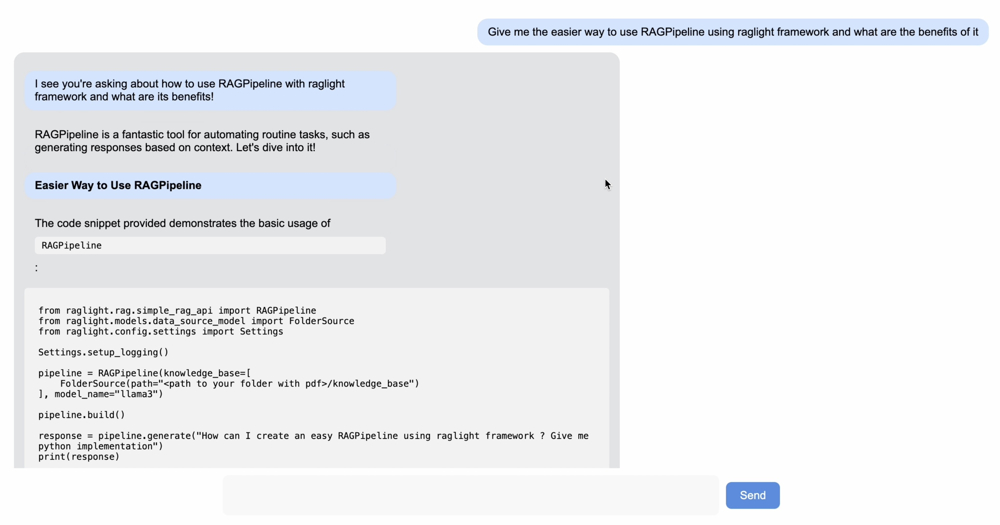

# RAGLight


[](https://pepy.tech/projects/raglight)

<div align="center">
    
</div>

**RAGLight** is a lightweight and modular Python library for implementing **Retrieval-Augmented Generation (RAG)**. It enhances the capabilities of Large Language Models (LLMs) by combining document retrieval with natural language inference.

Designed for simplicity and flexibility, RAGLight provides modular components to easily integrate various LLMs, embeddings, and vector stores, making it an ideal tool for building context-aware AI solutions. ✨

---

> ## ⚠️ Requirements
>
> Actually RAGLight supports :
>
> - Ollama
> - LMStudio
>
> You need to have Ollama or LMStudio running on your computer.
>
> If you use LMStudio, ou need to have the model you want to use loaded in LMStudio.

## Features 🔥

- 🌐 **Embeddings Model Integration**: Plug in your preferred embedding models (e.g., HuggingFace **all-MiniLM-L6-v2**) for compact and efficient vector embeddings.
- 🧙🏽 **LLM Agnostic**: Seamlessly integrates with different LLMs, such as **llama3** or custom providers, for natural language inference.
- ⚖️ **RAG Pipeline**: Combines document retrieval and language generation in a unified workflow.
- ⚖️ **RAT Pipeline**: Combines document retrieval and language generation in a unified workflow. Add reflection loops using a reasoning model like **Deepseek-R1** or **o1**.
- 🖋️ **Flexible Document Support**: Ingest and index various document types (e.g., PDF, TXT, DOCX).
- 🛠️ **Extensible Architecture**: Easily swap vector stores, embedding models, or LLMs to suit your needs.

---

## Import library 🛠️

If you want to install library, use :

```bash
pip install raglight
```

---

## Quick Start 🚀

### Use Default Pipeline ⭐️

You can setup with two lines your RAG with RAGLight:

```python
from raglight.rag.simple_rag_api import RAGPipeline
from raglight.models.data_source_model import FolderSource, GitHubSource
from raglight.config.settings import Settings

Settings.setup_logging()

pipeline = RAGPipeline(knowledge_base=[
FolderSource(path="<path to your folder with pdf>/knowledge_base"),
GitHubSource(url="https://github.com/Bessouat40/RAGLight")
], model_name="llama3")

pipeline.build()

response = pipeline.generate("How can I create an easy RAGPipeline using raglight framework ? Give me python implementation")
print(response)
```

#### Try using RAT (Retrieval Augmented Thinking)

This pipeline extends the Retrieval-Augmented Generation (RAG) concept by incorporating
an additional reasoning step using a specialized reasoning language model (LLM).

```python
from raglight.rat.simple_rat_api import RATPipeline
from raglight.models.data_source_model import FolderSource, GitHubSource
from raglight.config.settings import Settings

Settings.setup_logging()

pipeline = RATPipeline(knowledge_base=[
FolderSource(path="<path to your folder with pdf>/knowledge_base"),
GitHubSource(url="https://github.com/Bessouat40/RAGLight")
], model_name="llama3", reasoning_model_name="deepseek-r1:1.5b", reflection=2, provider=SETTINGS.OLLAMA, k=5) # default : provider = Settings.Ollama
# ], model_name="llama3", reasoning_model_name="deepseek-r1:1.5b", reflection=1, provider=SETTINGS.LMSTUDIO)

pipeline.build()

response = pipeline.generate("How can I create an easy RAGPipeline using raglight framework ? Give me the the easier python implementation")
print(response)
```

### Configure Your Own Pipeline

#### **1. Configure Your Pipeline**

Set up the components of your RAG pipeline:

```python
from raglight.rag.builder import Builder
from raglight.config.settings import Settings

rag = Builder() \
    .with_embeddings(Settings.HUGGINGFACE, model_name=model_embeddings) \
    .with_vector_store(Settings.CHROMA, persist_directory=persist_directory, collection_name=collection_name) \
    .with_llm(Settings.OLLAMA, model_name=model_name, system_prompt_file=system_prompt_directory, provider=Settings.LMStudio) \
    .build_rag(k = 5)
```

#### Ingest Documents Inside Your Vector Store

Use the pipeline to ingest documents into the vector store:

```python
rag.vector_store.ingest(file_extension='**/*.pdf', data_path='./data')
```

#### **3. Query the Pipeline**

Retrieve and generate answers using the RAG pipeline:

```python
response = rag.question_graph("How can I optimize my marathon training?")
print(response)
```

## Use RAGLight with Docker

You can use RAGLight inside a Docker container easily.
Find Dockerfile to do it here : **examples/Dockerfile.example**

### Build you image

Just go to **examples** directory and run :

```bash
docker build -t docker-raglight -f Dockerfile.example .
```

## Run you image

In order your container can communicate with Ollama or LMStudio, you need to add a custom host-to-IP mapping :

```bash
docker run --add-host=host.docker.internal:host-gateway docker-raglight
```

## UI For RAGLight

You can try this project : [LLMChat](https://github.com/Bessouat40/LLMChat) if you want a UI running locally.

<div align="center">
    
</div>
